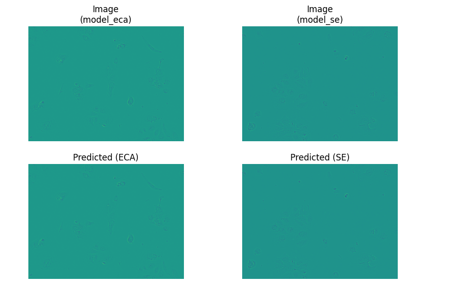
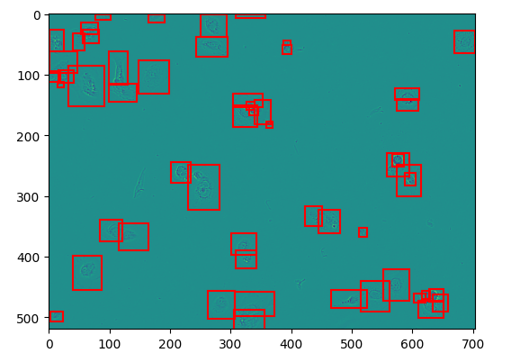
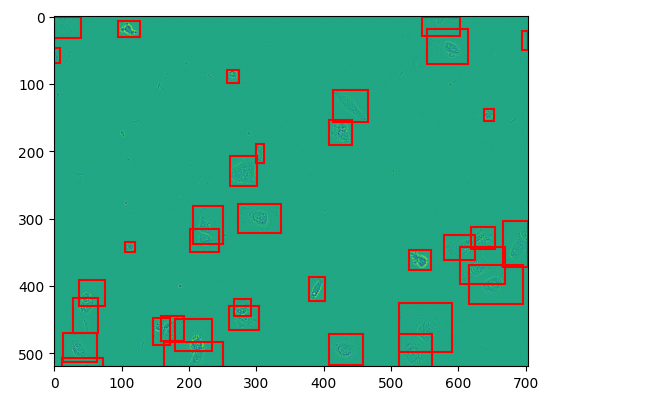

# LiveCellTest

# My Segmentation Models

This repository contains two segmentation models, FastRCNN and SE Model, designed for [LiveCellTest Dataset]. These models have been trained to perform [mask detection].

## Table of Contents

- [Models](#models)
- [Functionalities](#functionalities)
- [Docker](#docker)
- [Kubernetes](#kubernetes)
- [Results](#results)

## Models

### FastRCNN Model

- Pre-trained segmentation model with Efficient Channel Attention(ECA) using FastRCNN architecture.

### SE Model

- Pre-trained segmentation model with replace every ECA block by Squeeze-and-Excitation (SE) blocks as  SE architecture.


## Functionalities

## `MySegmentationModel` Class

The `MySegmentationModel` class represents the custom segmentation model, encompassing the following functionalities:

- **Preprocessing**: The `MySegmentationModel` class has incorporate preprocessing functions to prepare input images for inference, encompassing resizing, data augmentation, or normalization.

- **Model Architecture Definition**: The class defines the architecture of my segmentation model, specifying the layers, components, and connections that constitute the model.

- **Training and Inference**: The class includes methods for training the model on LiveCell dataset, involving forward and backward passes, loss computation, and optimization. Inference methods make predictions using the trained model.

## `SEModel` Class

The `SEModel` class focuses on creating a segmentation model using the Squeeze-and-Excitation (SE) architecture, providing the following functionalities:

- **Preprocessing**: The class may include image preprocessing methods, such as resizing or normalization, to prepare images for inference.

- **Model Architecture Modification**: The class modifies a ResNet backbone to include SE blocks in specific layers, enhancing feature recalibration to improve model performance.

- **Pre-trained Backbone**: The segmentation model leverages a pre-trained ResNet backbone as a feature extractor, benefiting from pre-trained weights for feature extraction.

- **Inference**: After initialization, an instance of the `SEModel` class can perform inference on images. The forward pass processes images through the modified architecture and provides segmentation predictions.

## Docker


### Build and Run Docker Image

To deploy the models using Docker, follow these steps:

1. Clone this repository to your local machine:

   ```bash
   git clone https://github.com/KannaRaghava/LiveCellTest.git
   cd your-segmentation-models

Build the Docker image:
```bash

    docker build -t segmentation-models .
```
Run the Docker container:

```bash

docker run -p 5000:5000 segmentation-models
```
The API should now be accessible at http://localhost:5000.


## Kubernetes

### Deploy on Kubernetes
To deploy the models using Kubernetes, follow these steps:


Apply the Kubernetes configuration to your cluster:

```bash

  kubectl apply -f your-segmentation-models-k8s/
```

Access the API using the defined service and endpoints.

## Results
Here are some visual results obtained using our segmentation models.

## Example 1



Describe the results and observations for this example.

## Example 2



Provide explanations or insights for the results in this example.

## Example 3


